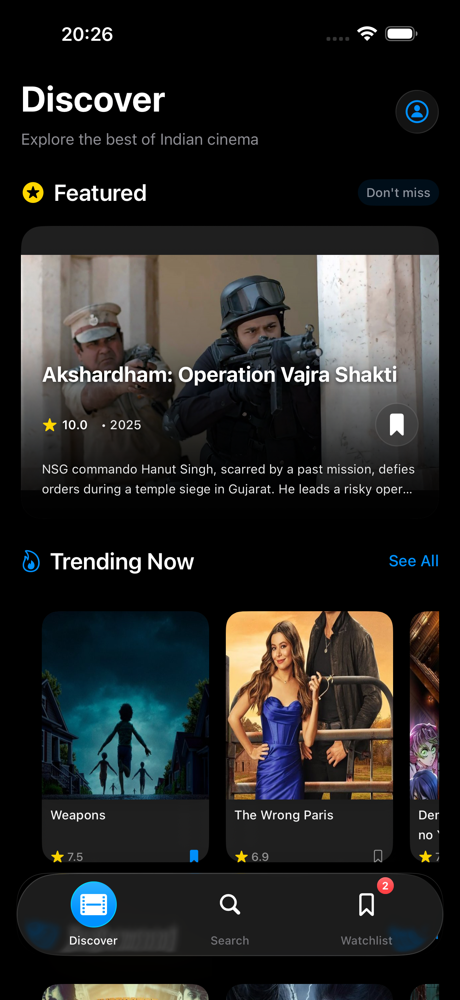
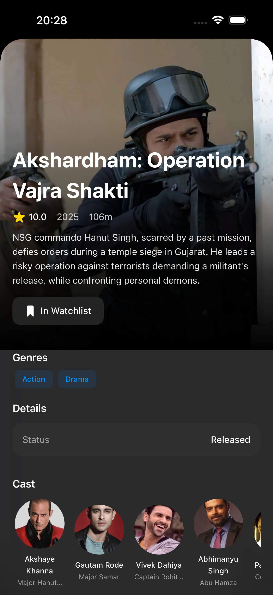
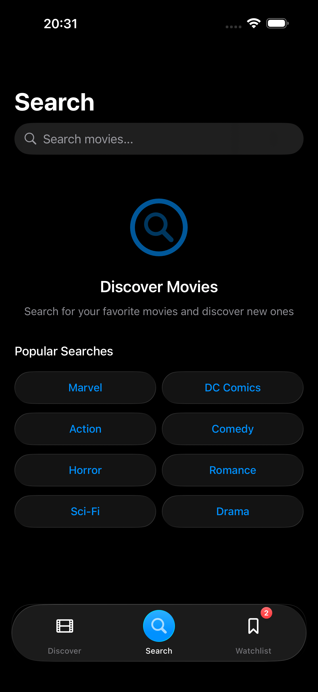
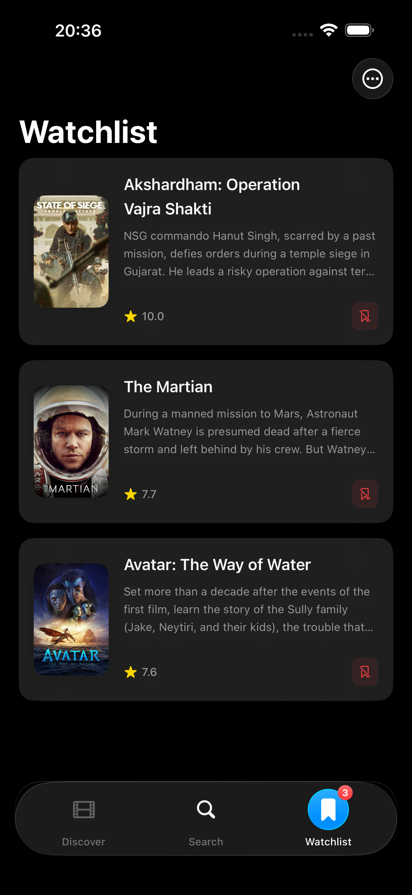

# 🎬 TMDB iOS App

A modern iOS movie discovery app built with SwiftUI, featuring beautiful Liquid Glass design and powered by The Movie Database (TMDB) API.

## 📱 Screenshots

<div align="center">
  
  
  
  
</div>

## ✨ Features

- **Movie Discovery**: Browse trending, popular, top-rated, and upcoming movies
- **Featured Movies**: Beautifully displayed featured content
- **Personal Watchlist**: Save and manage your favorite movies
- **Search**: Find movies by title with real-time search
- **Movie Details**: Comprehensive information including cast and ratings
- **Liquid Glass Design**: Modern iOS design with glass effects and materials
- **Dark Mode Support**: Optimized for both light and dark appearances
- **Smooth Animations**: Fluid transitions and micro-interactions

## 🚀 Getting Started

### Prerequisites

- Xcode 26 or later
- iOS 26 or later
- TMDB API Key

### Installation

1. **Clone the repository**

    ```bash
    git clone https://github.com/AmanSikarwar/tmdb-app.git
    cd tmdb-app
    ```

2. **Open in Xcode**

    ```bash
    open "TMDB APP.xcodeproj"
    ```

3. **Configure API Key**
   - Get your free API key from [TMDB](https://www.themoviedb.org/settings/api)
   - Replace the API key in `Utilities/Configuration.swift`:

    ```swift
    static let tmdbAPIKey = "YOUR_API_KEY_HERE"
    ```

4. **Build and Run**
   - Select your target device or simulator (iOS 17.0+)
   - Press `Cmd + R` to build and run

## 📱 Usage

- **Discover**: Browse featured movies and different categories
- **Search**: Find specific movies using the search functionality  
- **Watchlist**: Save movies to your personal collection
- **Movie Details**: Tap any movie to view detailed information

## 🛠️ Technical Details

### Architecture

- **MVVM Pattern**: Clean separation with reactive data binding
- **SwiftUI**: Modern declarative UI framework
- **Combine**: Reactive programming for data flow
- **TMDB API**: Movie data and images

### Key Features

- Async/await for network operations
- Custom Liquid Glass UI components
- Local watchlist storage
- Pull-to-refresh functionality
- Dark mode support

## 📄 License

This project is licensed under the MIT License.
